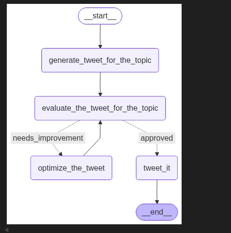
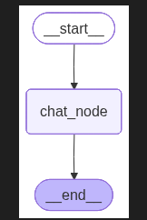

# LangGraph

#  Create Environment

1. Create virtual env by running command : `python -m venv agentaienv`
2. Activate virtual env by running command : `agentaienv\Scripts\activate`
3. Install necessary libraries by running : `pip install -r requirements.txt`

## Iterative workflow

## Chat_workflow
